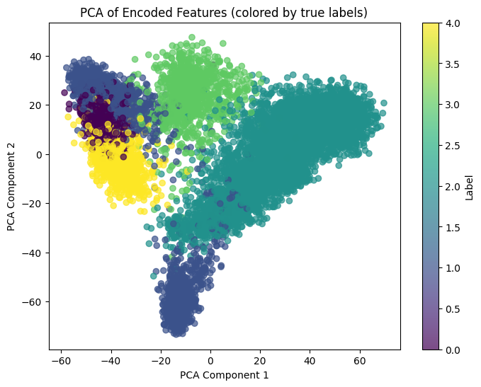
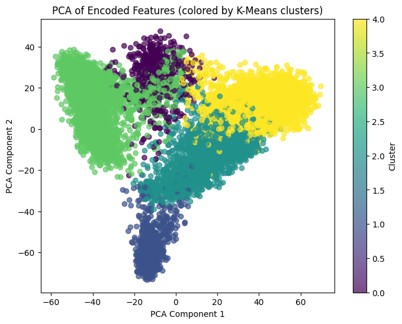
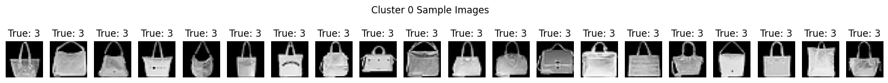
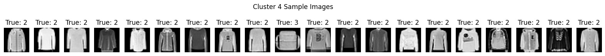
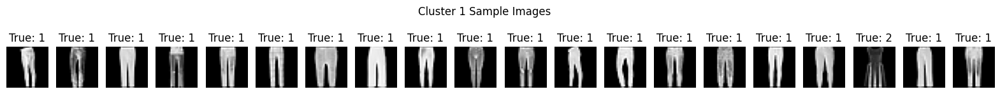

# Assignment 3

## Q1 Default Network

Following the requirements in the provided architecture, this is the summary of the model:


### Training and Validation Accuracy vs Epochs


### Training and Validation Loss vs Epochs


### Test Accuracy

After training the model, it was evaluated with the test set.


## Q2 Your Own Improvements

1. We introduced a validation set along with the training and test set by splitting the training set into 80% training, 20% validation. This would help the model to tune its hyperparameters while training, before testing its generalisation performance on the test set.

2. Image augmentation was performed to increase the diversity of the training data and its size.
	```
	data_augmentation = ImageDataGenerator(
		rotation_range=15,
		width_shift_range=0.15,
		height_shift_range=0.15,
		shear_range=0.1,
		zoom_range=0.2,
		horizontal_flip=True,
	)
	```

3. We tried out a new architecture for the model by introducting `BatchNormalization` to stabilise and accelerate the training process through the normalising of inputs to each layer. Secondly, we introduced `Dropout` layers to prevent overfitting, by dropping a fraction of nodes during training. Thirdly, we increased the number of filters for each layer so that it will be able to extract more features from the dataset. Lastly, we tried using Adam optimiser for better learning. 
	```
	def build_improved_cnn():
		model = keras.Sequential([
			layers.Conv2D(64, (3, 3), input_shape=(28, 28, 1), strides=1, padding='same', activation='relu'),
			layers.BatchNormalization(),
			layers.MaxPooling2D((2, 2)),
			layers.Dropout(0.15),

			layers.Conv2D(128, (3, 3), strides=1, padding='same', activation='relu'),
			layers.BatchNormalization(),
			layers.MaxPooling2D((2, 2)),
			layers.Dropout(0.15),

			layers.Conv2D(256, (3, 3), strides=1, padding='same', activation='relu'),
			layers.BatchNormalization(),
			layers.MaxPooling2D((2, 2)),
			layers.Dropout(0.15),

			layers.Flatten(),
			layers.Dense(512, activation='relu'),
			layers.BatchNormalization(),
			layers.Dropout(0.25),
			layers.Dense(5, activation='softmax')
		])

		model.compile(
			optimizer=keras.optimizers.Adam(learning_rate=3e-4),
			loss='categorical_crossentropy',
			metrics=['accuracy']	
		)

		return model
	```

4. We also implemented callbacks like `ReduceLROnPlateau` to adjust the learning rate dynamically, and `EarlyStopping` to stop training when `val_loss` stops improving and restores the best weights.

## Q3 Result Analysis
### Model summary
This is the summary of the model:


### Runtime analysis

||Base Network|Improved Network|
|------------|------------|----------------|
|**Training Runtime**|160.65 seconds|1467.06 seconds|
|**Testing Runtime**|2.67 seconds|3.32 seconds|

**Comments on Runtimes:**
The improved network takes significantly longer to train compared to the base network—about 10 times longer (1467.06 seconds vs. 160.65 seconds). This is expected because the improved model is deeper and more complex, with more convolutional layers, additional regularization (dropout and batch normalization), and the overhead of data augmentation. All these enhancements increase the number of operations and therefore the overall training time.

On the other hand, the testing (or inference) runtime only increases marginally (from 2.67 seconds to 3.32 seconds), which indicates that despite the added complexity, the model is still efficient enough for deployment. In many practical applications, inference speed is critical, and a small increase in testing time is often acceptable.

When judging whether the increased training runtime is worth the improvement in accuracy, we have to consider the following:
- **Accuracy Gains:** The improved network reaches a higher validation and test accuracy (around 98.4% compared to approximately 97.1% for the base network). This improvement of about 1–1.5% can be crucial in applications where even small improvements lead to better decision-making.
- **Model Robustness:** The additional layers, data augmentation, and regularization techniques not only boost accuracy but also help the model generalize better to unseen data, potentially reducing overfitting.
- **Deployment Considerations:** Since the inference time is only slightly affected, the extra training time does not negatively impact real-time performance.

Ultimately, if achieving higher predictive performance and improved robustness is the priority, then the increased training time is a worthwhile trade-off. That being said, should computation power or time be a significant limiting factor, we can settle for the base network as the gains in testing accuracy are marginal and might not be critical since the context of this problem is only classifying fashion images.


### Hyper parameters and designs used
In our improved network, we tweaked the base network to include the following changes:
1. Increased Network depth and Complexity
	- The improved network used a deeper and wider network with 3 convolutional blocks, each increasing the number of filters (64 --> 128 --> 258). This design helps the network learn more complex features at different levels of abstraction.
2. Regularization
	- The improved network uses Dropout in several layers (0.15 in conv blocks and 0.25 before the final dense layer) and Batch Normalization after each Conv2D and Dense layer. These techniques help stabilize training and prevent overfitting by reducing internal covariate shift and randomly dropping out a subset of neurons during training.
3. Data Augmentation
	- The improved network implements a robust data augmentation strategy using random rotations, shifts, shearing, zoom, and horizontal flipping. This increases the effective size and variability of the training set, allowing the model to generalize better to unseen data.
4. Optimizer and Learning Rates
	- The improved network uses the Adam optimizer with an initial learning rate of 3e-4, along with a learning rate scheduler (`ReduceLROnPlateau`) that reduces the learning rate when the validation loss plateaus.
	- This allows the improved model to be superior to the base network which uses SGD, as SGD requires careful tuning of the learning rate and momentum, while Adam automatically adapts the learning rate during training—often resulting in faster convergence and better overall performance.
5. Training Epochs & Batch size
	- The improved network trains for up to 20 epochs (with EarlyStopping potentially stopping earlier) using a smaller batch size of 32, which is typical when using data augmentation as it provides more frequent weight updates and can capture more nuanced variations in the data.
	- The base network trains for 10 epochs with a batch size of 64, which is less ideal than the improved network because a larger batch size with fewer epochs results in fewer weight updates and can limit the model’s ability to learn from the increased diversity provided by data augmentatio
6. Validation Strategy
	- The improved network separates the training data into dedicated training and validation sets using `train_test_split` to monitor performance more robustly during data augmentation.
	- The base network uses a built-in validation split of 20% from the training data which may not be as effective in monitoring performance under augmented data conditions.


### Training and Validation Loss vs Epochs


### Training and Validation Classification Accuracy vs Epochs


### Test Accuracy

After training the model, it was evaluated with the test set.


Through the improvements, the test accuracy increased from 0.9714 to 0.9847.

## Q4 Using self created encoding

### PCA visualization
  

The PCA plot of the encoded features reveals distinct clusters that largely correspond to the label values used for coloring. The first two principal components capture a significant portion of the variance in the data, allowing us to see how the network's learned representations separate different classes.

1. **Cluster Separation:**
- We can observe several clusters where points of similar colors (labels) group together. This indicates that the network has learned to encode the data in such a way that similar items (by label) end up close to each other in the feature space.
2. **Overlap Between Clusters:**
- While many clusters are distinct, there are regions where the clusters overlap. This suggests that for some classes, the encoded features share common characteristics, or that the network finds it challenging to fully disentangle these classes in the reduced 2D space.
3. **Variance Capture:**
- The first two PCA components appear to capture enough variance to provide a clear visual separation for most classes, demonstrating that the encoding is meaningful and effectively highlights differences among the classes.

Overall, the PCA visualization supports the idea that the internal feature representations learned by the model are discriminative, with clear groupings that align with the underlying label values, despite some natural overlaps where classes may share visual similarities.

### Visualizing result from K-means clustering


Comparing the PCA cluster plot and K-means cluster plot, we observe the following differences:
1. **Color Mapping and Grouping:**
- PCA Plot:
	- The PCA plot uses the true label values for coloring. This naturally shows how the network’s learned features group the data according to the original class assignments. We can see that some classes form fairly distinct clusters, while others have overlapping regions. This indicates that the model’s encoding captures some intrinsic differences between classes, though there is ambiguity for classes with similar visual features.
- K-means Cluster Plot:
	- In contrast, the K-means plot assigns colors based on unsupervised clustering into 5 groups. Here, the algorithm forces the data into five discrete clusters. Some of these clusters align well with the natural separations observed in the PCA plot, but in other areas, the boundaries may split or merge regions that, by true labels, would otherwise appear as overlapping.
2. **Cluster Boundaries and Overlap:**
- PCA Plot:
	- The PCA projection shows smoother transitions and more gradual overlaps between classes. The clusters are spread out according to the variance captured in the first two principal components, revealing how the data naturally distributes without any external grouping constraints.
- K-means Cluster Plot:
	- The K-means plot, on the other hand, delineates sharper boundaries between groups because the algorithm partitions the data into exactly five clusters. This may highlight subtle differences in the feature space that are not immediately obvious from the true labels alone, or it might force a division where the natural data distribution is more continuous.
3. **Interpretation of the Groupings:**
- PCA Plot:
	- This plot provides an overall view of the intrinsic feature structure as learned by the model, showing both clearly separated groups and areas where different true classes are intermingled. It’s useful for understanding how well the model has learned to differentiate between the given labels.
- K-means Cluster Plot:
	- The clustering result offers an alternative perspective. By grouping the features into five clusters, it can reveal if the underlying feature space contains additional structure that might even suggest a different grouping than the provided labels. For instance, if one K-means cluster spans parts of two true classes, it may indicate that those classes share similar characteristics in the feature space.

### t-SNE visualization


### Visually inspecting clusters
  
From visually inspecting cluster 0 we can tell that Label 3 likely corresponds to `"handbags"`, since all the images in cluster 0 show handbags.

  
  
From visually inspecting cluster 2 and 4 we can tell that Label 2 likely corresponds to `"tops"`, since cluster 2 shows mostly short sleeved tops and dresses and cluster 4's images are long sleeved tops like crewnecks and hoodies.

  
  
Cluster 1 are a collection of images of pants and cluster 3 are a collection of images of shoes. However in cluster 3 the shoes all have multiple true label values.  
We observe that the sneakers in cluster 3 all have true label 0, which means label 0 likely corresponds to `"sneakers"`.  
The boots in cluster 3 have a true label value of 1, which is the same true label as the pants in cluster 1, this means that label 1 might be `"boots and pants"`.
The open toe sandals in cluster 3 all have true label of 4, which means label 4 might likely be `"sandals"`.ß

